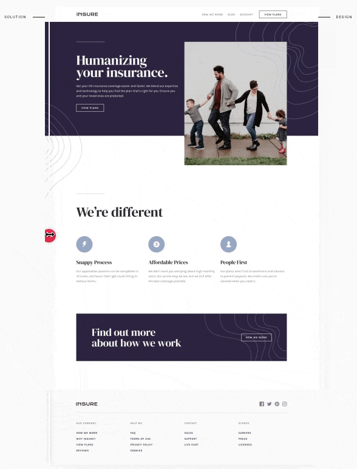

# [Frontend Mentor](https://www.frontendmentor.io) - Insure Landing Page

## Solution preview

  

   Solution preview by <a href="https://www.frontendmentor.io/solutions/insure-landing-page-GaMK1QZAW">Frontend Mentor</a>

## The challenge

The challenge is to build out this landing page and get it looking as close to the design as possible.

- Sketch file is provided
- Optimized assets are found in the `/images` folder.
- There is also a `style-guide.md` file, which contains the information such as color palette and fonts.

User Stories:

- View the optimal layout for the component depending on their device's screen size
- See hover states for all interactive elements on the page

## Technologies I used

- SCSS, BEM, Flexbox, NPM, [Perfect Pixel](https://www.welldonecode.com/perfectpixel). Navbar functionality was built by pure CSS.
